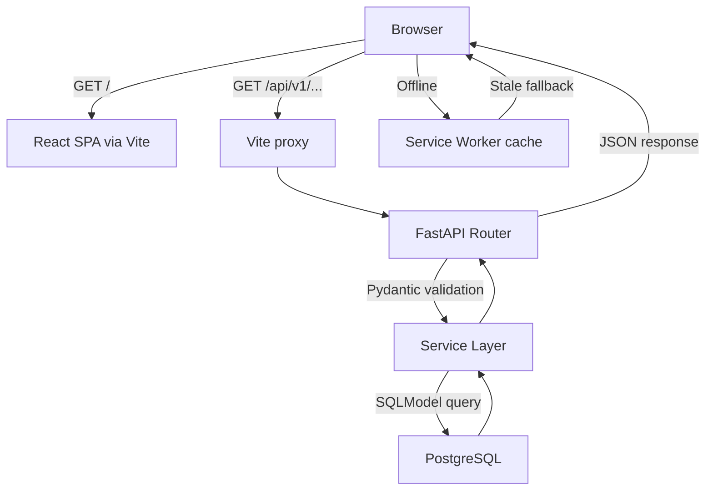

# Architecture — Expense Tracker v2.3.0

> **Author:** Sayu-V | Yenepoya University
> **Updated:** 2026-03-29

See also: [[docs/04_Tech_Stack]] · [[docs/05_HLD]] · [[docs/06_LLD]] · [[README]] · [[CHANGELOG]]

---

## 1. System Overview

The Expense Tracker is a three-tier, containerised full-stack web application. All three tiers run inside Docker containers orchestrated by Docker Compose and communicate over a shared Docker network.

```
┌──────────────────────────────────────────────────────────────┐
│                     Docker Compose Network                    │
│                                                               │
│  ┌───────────────┐    ┌───────────────┐   ┌───────────────┐  │
│  │   Frontend    │───▶│   Backend     │──▶│   Database    │  │
│  │ React + Vite  │    │   FastAPI     │   │  PostgreSQL   │  │
│  │  Port 5173    │    │  Port 8000    │   │   Port 5432   │  │
│  └───────────────┘    └───────────────┘   └───────────────┘  │
│          │                                                    │
│   Service Worker                                             │
│   (PWA offline cache)                                        │
└──────────────────────────────────────────────────────────────┘
```

> [!tip] Visual diagram
> See `docs/expense_tracker_architecture.svg` for the full visual architecture diagram.

---

## 2. Layer Architecture

### 2.1 Frontend (Presentation Layer)

| Component | Technology | Role |
|-----------|------------|------|
| Build Tool | Vite 5 | Dev server + production bundler |
| UI Library | React 18 | Component-based rendering |
| Router | React Router v6 | Client-side SPA navigation |
| Charts | Recharts | Data visualisation widgets |
| HTTP Client | Axios | REST API communication |
| PWA | Service Worker (native) | Offline caching |

**Pages (v2.3.0):**

| Page | Route | Description |
|------|-------|-------------|
| `Dashboard` | `/` | 6 widgets: spend, charts, budget, insights, YoY, prediction |
| `Expenses` | `/expenses` | Full CRUD, filters, cursor pagination, bulk-delete, CSV export |
| `Budgets` | `/budgets` | Per-category budget limits with progress bars |
| `Chat` | `/chat` | NLP chat with inline charts and quick-reply chips |
| `RecurringExpenses` | `/recurring` | Recurring expense templates |
| `Alerts` | `/alerts` | Spending alerts with severity badges |
| `Goals` | `/goals` | Savings goals with animated SVG progress rings |
| `Settings` | `/settings` | Tabbed hub: Categories · Import · Import Rules · What's New |

> [!note] Sidebar consolidation (v2.3.0)
> Categories, Import, Import Rules, and Feature Updates are no longer standalone sidebar items. They live inside the `⚙️ Settings` hub at `/settings?tab=<name>`. Legacy routes (`/categories`, `/import`, `/import-rules`, `/features`) redirect automatically via React Router `<Navigate replace>`.

**Theme system:**

Three themes cycle via a single topbar toggle (☀️ → 🌙 → 🌌 → ☀️):

| Theme | Key CSS | Notes |
|-------|---------|-------|
| `light` | Default `:root` variables | Clean, accessible |
| `dark` | `[data-theme="dark"]` overrides | Full dark palette |
| `galaxy` | `[data-theme="galaxy"]` overrides | Glass-morphism + animated orbs |

Galaxy mode adds a `GalaxyOrbs` component — three `position: fixed` radial-gradient orbs animated via `@keyframes`. All surfaces use `backdrop-filter: blur()` over the orb layer.

All API calls are proxied through Vite's dev server (`/api` → `http://backend:8000`) — the browser never makes cross-origin requests.

---

### 2.2 Backend (Application Layer)

Structured with strict separation of concerns across four sub-layers:

```
Routers (HTTP)  →  Services (Business Logic)  →  Models (ORM)  →  DB
```

| Sub-layer | Files | Responsibility |
|-----------|-------|----------------|
| **Routers** (11) | `expenses`, `categories`, `budgets`, `reports`, `insights`, `chat`, `recurring`, `alerts`, `goals`, `imports`, `import_rules` | HTTP request/response, status codes, Pydantic validation |
| **Services** (8) | `expense_service`, `budget_service`, `report_service`, `insights_service`, `chat_service`, `categorizer_service`, `import_service`, `import_rules_service` | All business logic, DB queries, calculations |
| **Models** | `models.py` | 8 SQLModel table definitions |
| **Schemas** | `schemas.py` | 30+ Pydantic v2 request/response shapes |
| **Config** | `config.py`, `database.py` | Settings from `.env`, engine/session factory |

> [!important] No DB logic in routers
> All database queries are delegated to the service layer. Routers only handle HTTP concerns (input validation, status codes, response serialisation).

---

### 2.3 Database Layer

PostgreSQL 15 with ==8 tables== (expanded from 3 in v1.0.0):

```
categories          expenses                   budgets
──────────          ────────                   ───────
id (PK)             id (PK)                    id (PK)
name (unique)       amount (>0)                amount (>0)
color               description (max 200)      month (1–12)
emoji               notes (max 500)            year (>=2020)
is_default          date (indexed)             category_id (FK)
created_at          type (expense/income)       created_at
                    created_at
                    category_id (FK, indexed)

recurring_expenses  spending_alerts            goals
──────────────────  ───────────────            ─────
id (PK)             id (PK)                    id (PK)
description         type                       name
amount              severity                   target_amount
category_id (FK)    message                    current_amount
frequency           is_read                    deadline
next_date           category_id (FK)           is_completed
is_active           created_at                 created_at
notes

income_sources      import_rules
──────────────      ────────────
id (PK)             id (PK)
name                name
type                priority
sender_keyword      condition_logic (AND/OR)
expected_amount     conditions (JSON)
expected_day        actions (JSON)
                    is_active
                    match_count
                    last_matched_at
```

**Data persists** via a named Docker volume (`postgres_data`). The backend runs `ALTER TABLE … IF NOT EXISTS` migrations on startup for zero-downtime column additions.

---

## 3. Request Flow



> [!info] Offline behaviour
> The Service Worker uses two strategies:
> - **App shell** (HTML, JS, CSS): cache-first — app loads instantly from cache
> - **API calls** (`/api/*`): network-first with stale-cache fallback — returns last-known data with a `503` JSON placeholder when offline

See `docs/expense_request_flow.svg` for the full visual flow.

---

## 4. Import & Classification Pipeline

The bank statement import feature uses a 3-pass classification waterfall:

```
Uploaded PDF/CSV
       │
       ▼
   parse_and_preview()
       │
       ├── Pass 1: Import Rules engine
       │     └── Runs all active ImportRule objects (ordered by priority)
       │         Match → set type + category + rename + skip
       │
       ├── Pass 2: Income Sources lookup
       │     └── Keyword match against income_sources.sender_keyword
       │         Match (high confidence) → set type=income + category
       │
       └── Pass 3: Built-in keyword engine
             └── 50+ merchant keywords, UPI/NEFT/IMPS direction rules
                 Match → set type + category (medium/low confidence)
                 No match → flag ⚠️ for manual review

       │
       ▼
   Preview table shown to user
   (per-row type selector, category dropdown, skip checkbox)
       │
       ▼
   confirm_import()
   └── Bulk-creates Expense rows for all non-skipped entries
```

---

## 5. Insights Engine

The AI insights engine runs server-side on every `GET /api/v1/insights` call. No external APIs or ML models are used — all 10 rules are deterministic Python.

```
GET /api/v1/insights
       │
       ▼
insights_service.generate_insights(session)
       │
       ├── Rule 1:  budget_overspend    — actual > budget?
       ├── Rule 2:  burn_rate           — on track to exceed budget?
       ├── Rule 3:  mom_spike           — this month > last by 30%+?
       ├── Rule 4:  top_category        — highest-spend category?
       ├── Rule 5:  unusual_expense     — single item > 2× category avg?
       ├── Rule 6:  savings_opportunity — under budget 2 months running?
       ├── Rule 7:  streak              — no spend in 3+ days?
       ├── Rule 8:  daily_rate          — projected month-end total?
       ├── Rule 9:  savings_rate        — % of income being saved?
       └── Rule 10: yoy_comparison      — vs same month last year ≥15%?
               │
               ▼
       Returns: List[Insight] { type, message, severity, category_id }
```

---

## 6. Environment & Configuration

All secrets kept out of source code via `.env`:

| Variable | Used By | Purpose |
|----------|---------|---------|
| `POSTGRES_USER` | db, backend | DB username |
| `POSTGRES_PASSWORD` | db, backend | DB password |
| `POSTGRES_DB` | db, backend | Database name |
| `DATABASE_URL` | backend | Full SQLAlchemy connection URL |
| `ALLOWED_ORIGINS` | backend | CORS allowed origins |

> [!warning] Windows deployment
> The `.gitattributes` file (`* text=auto eol=lf`) prevents CRLF line endings from being injected into Dockerfiles and shell scripts when cloning on Windows. Always clone after this file is committed. See [[docs/04_Tech_Stack]] for rationale.

---

## 7. PWA Architecture

```
index.html
  └── registers sw.js on window.load (only in production-like env)

sw.js
  ├── CACHE_VERSION = 'v2.3.0'
  ├── APP_SHELL_CACHE — cache-first strategy
  │     Cached: /, /assets/*, *.js, *.css, fonts
  └── API_CACHE      — network-first strategy
        /api/*: fetch live → fallback to cache → 503 JSON if both fail
        Cache auto-purged on SW activate when version changes
```

---

## 8. Folder Structure (v2.3.0)

```
expense-tracker/
├── backend/
│   ├── app/
│   │   ├── main.py               # Startup seeding, router registration
│   │   ├── config.py             # pydantic-settings
│   │   ├── database.py           # Engine, session, ALTER TABLE migrations
│   │   ├── models.py             # 8 SQLModel table classes
│   │   ├── schemas.py            # 30+ Pydantic schemas
│   │   ├── routers/              # 11 router files
│   │   └── services/             # 8 service files
│   ├── tests/
│   ├── .env.example
│   └── requirements.txt
├── frontend/
│   ├── public/
│   │   ├── sw.js                 # Service Worker
│   │   ├── manifest.json         # PWA manifest
│   │   └── icon.svg              # App icon
│   ├── src/
│   │   ├── api/                  # Axios modules
│   │   ├── components/           # SplashScreen, PeriodSelector, EditExpenseModal
│   │   ├── context/              # PeriodContext
│   │   ├── hooks/                # useAutoRefresh, useChartTheme
│   │   ├── pages/                # 12 page components (incl. Settings.jsx)
│   │   ├── App.jsx               # Shell, theme cycle, splash, routing
│   │   └── index.css             # Design system + 3 theme blocks
│   ├── Dockerfile
│   └── package.json
├── docs/                         # Architecture, HLD, LLD, PRD, Walkthrough
├── .gitattributes                # LF enforcement
├── docker-compose.yml
├── CHANGELOG.md
└── README.md
```
