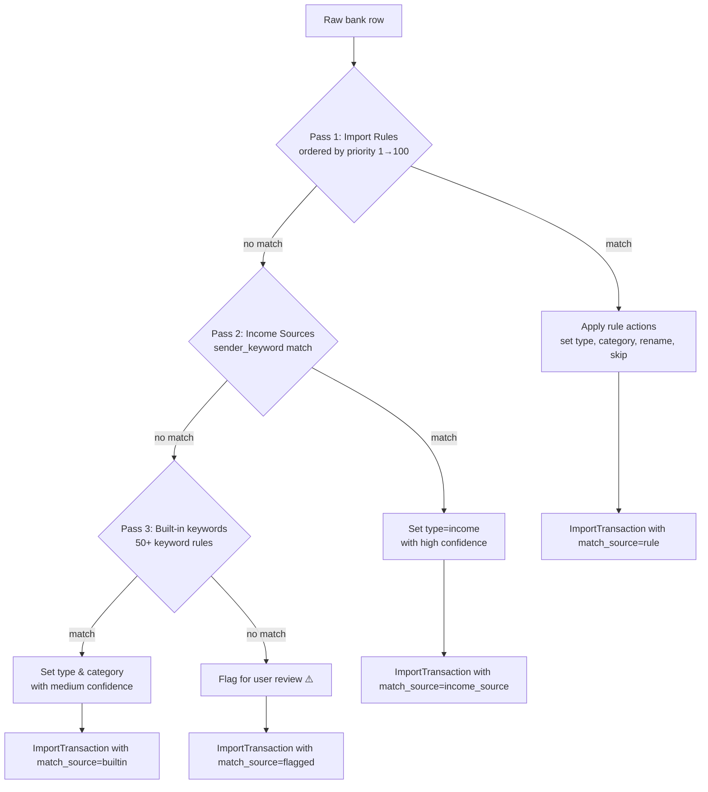

# API Reference

> [!info] Base URL
> All endpoints are prefixed with `/api/v1`.
> Running locally: `http://localhost:8000/api/v1`
> Interactive docs (auto-generated): `http://localhost:8000/docs` (Swagger UI) · `http://localhost:8000/redoc`

See also: [[docs/06_LLD]] · [[docs/05_HLD]] · [[README]] · [[docs/03_Architecture]]

---

## Overview

```
Base URL  : http://localhost:8000/api/v1
Format    : JSON (application/json)
Auth      : None (single-user self-hosted deploy)
Versioning: URI-based (/api/v1/…)
```

### Router Groups

```mermaid
graph LR
    A[Client] --> B[/api/v1]
    B --> C[expenses]
    B --> D[categories]
    B --> E[budgets]
    B --> F[reports]
    B --> G[insights]
    B --> H[chat]
    B --> I[recurring-expenses]
    B --> J[alerts]
    B --> K[goals]
    B --> L[import + income-sources]
    B --> M[import-rules]
    B --> N[health]
```

### Common Conventions

| Convention | Detail |
|---|---|
| `id` path params | Integer primary keys (PostgreSQL SERIAL) |
| Dates | `YYYY-MM-DD` string (ISO 8601) |
| Amounts | Float, rounded to 2 decimal places |
| Pagination | Cursor-based for `/expenses`; full list for all others |
| Bulk ops | `POST /…/bulk-delete` with `{"ids": [1, 2, 3]}` |
| Empty 204 | Delete operations return 204 No Content with empty body |

### Error Responses

> [!warning] Validation errors return HTTP 422
> FastAPI/Pydantic automatically returns 422 Unprocessable Entity with field-level error details when request body fails validation.

```json
{
  "detail": [
    {
      "type": "value_error",
      "loc": ["body", "amount"],
      "msg": "Value error, amount must be greater than 0",
      "input": -5
    }
  ]
}
```

| Status | Meaning |
|---|---|
| `200 OK` | Successful read / update |
| `201 Created` | Successful create (POST) |
| `204 No Content` | Successful delete |
| `404 Not Found` | Resource with given `id` does not exist |
| `422 Unprocessable Entity` | Request body failed Pydantic validation |
| `500 Internal Server Error` | Unexpected server-side error |

---

## Health

### `GET /health`

Returns API version and liveness status. Used by Docker Compose `healthcheck`.

**Response `200`**
```json
{
  "status": "ok",
  "version": "2.3.0"
}
```

**cURL**
```bash
curl http://localhost:8000/health
```

---

## 1. Expenses

> [!note] Router prefix: `/api/v1/expenses`
> Handles expense and income entries. Both types share the same table — differentiated by the `type` field.

### Endpoint Summary

| Method | Path | Description | Since |
|---|---|---|---|
| `GET` | `/expenses` | List expenses with cursor pagination | v1.0.0 |
| `POST` | `/expenses` | Create a new expense/income entry | v1.0.0 |
| `GET` | `/expenses/{id}` | Get a single entry by ID | v1.0.0 |
| `PUT` | `/expenses/{id}` | Update an entry (partial update) | v1.0.0 |
| `DELETE` | `/expenses/{id}` | Delete a single entry | v1.0.0 |
| `POST` | `/expenses/bulk-delete` | Delete multiple entries by ID list | v1.5.0 |
| `GET` | `/expenses/suggest-category` | AI auto-suggest category from description | v1.1.0 |

---

### `GET /expenses`

Returns a paginated list of expenses/income. Uses ==cursor-based keyset pagination== for stable results even while new rows are inserted.

**Query Parameters**

| Parameter | Type | Default | Description |
|---|---|---|---|
| `page_size` | int | `50` | Items per page (1–200) |
| `cursor` | string | `null` | Opaque cursor from previous `next_cursor` |
| `date_from` | date | — | Filter: entries on or after this date |
| `date_to` | date | — | Filter: entries on or before this date |
| `category_id` | int | — | Filter: specific category |
| `type` | string | — | Filter: `expense` or `income` |
| `search` | string | — | Filter: case-insensitive substring match on description |
| `min_amount` | float | — | Filter: amount ≥ value |
| `max_amount` | float | — | Filter: amount ≤ value |

**Response `200` — `ExpensePage`**
```json
{
  "items": [
    {
      "id": 42,
      "amount": 350.00,
      "category_id": 3,
      "category": { "id": 3, "name": "Food", "color": "#f59e0b", "emoji": "🍔", "category_type": "expense", "is_default": true, "created_at": "..." },
      "description": "Zomato order",
      "notes": null,
      "date": "2026-03-28",
      "type": "expense",
      "created_at": "2026-03-28T12:00:00",
      "updated_at": "2026-03-28T12:00:00"
    }
  ],
  "next_cursor": "eyJkYXRlIjogIjIwMjYtMDMtMjgiLCAiaWQiOiA0Mn0=",
  "has_more": true,
  "total": 247
}
```

**cURL**
```bash
# First page
curl "http://localhost:8000/api/v1/expenses?page_size=25&type=expense&date_from=2026-03-01&date_to=2026-03-31"

# Next page using cursor
curl "http://localhost:8000/api/v1/expenses?page_size=25&cursor=eyJkYXRlIjogIjIwMjYtMDMtMjgiLCAiaWQiOiA0Mn0="
```

---

### `POST /expenses`

Create a new expense or income entry.

**Request Body — `ExpenseCreate`**
```json
{
  "amount": 350.00,
  "category_id": 3,
  "description": "Zomato order",
  "notes": "Dinner for two",
  "date": "2026-03-28",
  "type": "expense"
}
```

| Field | Type | Required | Validation |
|---|---|---|---|
| `amount` | float | ✅ | > 0 |
| `category_id` | int | ✅ | Must exist |
| `description` | string | ✅ | Non-blank |
| `notes` | string | — | Optional |
| `date` | date | ✅ | YYYY-MM-DD |
| `type` | string | — | `expense` (default) \| `income` |

**Response `201` — `ExpenseRead`**
```json
{
  "id": 42,
  "amount": 350.00,
  "category_id": 3,
  "category": { "id": 3, "name": "Food", "emoji": "🍔", "color": "#f59e0b", "category_type": "expense", "is_default": true, "created_at": "..." },
  "description": "Zomato order",
  "notes": "Dinner for two",
  "date": "2026-03-28",
  "type": "expense",
  "created_at": "2026-03-28T12:00:00",
  "updated_at": "2026-03-28T12:00:00"
}
```

**cURL**
```bash
curl -X POST http://localhost:8000/api/v1/expenses \
  -H "Content-Type: application/json" \
  -d '{"amount": 350.00, "category_id": 3, "description": "Zomato order", "date": "2026-03-28", "type": "expense"}'
```

---

### `GET /expenses/{id}`

Retrieve a single expense or income entry.

**Response `200` — `ExpenseRead`** (same shape as POST response)

**cURL**
```bash
curl http://localhost:8000/api/v1/expenses/42
```

---

### `PUT /expenses/{id}`

Partial update — only supplied fields are changed. All fields optional.

**Request Body — `ExpenseUpdate`**
```json
{
  "amount": 400.00,
  "description": "Zomato order (updated)",
  "category_id": 5,
  "notes": "Added dessert",
  "date": "2026-03-28",
  "type": "expense"
}
```

**Response `200` — `ExpenseRead`**

**cURL**
```bash
curl -X PUT http://localhost:8000/api/v1/expenses/42 \
  -H "Content-Type: application/json" \
  -d '{"amount": 400.00}'
```

---

### `DELETE /expenses/{id}`

Delete a single entry. **Response `204` No Content.**

**cURL**
```bash
curl -X DELETE http://localhost:8000/api/v1/expenses/42
```

---

### `POST /expenses/bulk-delete`

Delete multiple entries in one request.

**Request Body — `BulkDeleteRequest`**
```json
{ "ids": [10, 11, 42, 55] }
```

**Response `200`**
```json
{ "deleted_count": 4 }
```

**cURL**
```bash
curl -X POST http://localhost:8000/api/v1/expenses/bulk-delete \
  -H "Content-Type: application/json" \
  -d '{"ids": [10, 11, 42]}'
```

---

### `GET /expenses/suggest-category`

AI auto-categorisation using local keyword matching (no external API). Returns `confidence: "high"` when a strong keyword match is found.

**Query Parameters**

| Parameter | Type | Required | Description |
|---|---|---|---|
| `description` | string | ✅ | Transaction description to classify |

**Response `200` — `SuggestCategoryResponse`**
```json
{
  "description": "Zomato order",
  "suggested_category_id": 3,
  "suggested_category_name": "Food",
  "suggested_category_emoji": "🍔",
  "confidence": "high"
}
```

**cURL**
```bash
curl "http://localhost:8000/api/v1/expenses/suggest-category?description=Zomato+order"
```

---

## 2. Categories

> [!note] Router prefix: `/api/v1/categories`
> Manages expense and income categories. 25 default categories are seeded on first startup. Default categories cannot be deleted.

### Endpoint Summary

| Method | Path | Description |
|---|---|---|
| `GET` | `/categories` | List all categories |
| `POST` | `/categories` | Create a custom category |
| `PUT` | `/categories/{id}` | Update name, emoji, or color |
| `DELETE` | `/categories/{id}` | Delete a custom category |

---

### `GET /categories`

**Query Parameters**

| Parameter | Type | Description |
|---|---|---|
| `category_type` | string | Filter: `expense` or `income` |

**Response `200` — `list[CategoryRead]`**
```json
[
  {
    "id": 1,
    "name": "Food",
    "color": "#f59e0b",
    "emoji": "🍔",
    "category_type": "expense",
    "is_default": true,
    "created_at": "2026-03-27T10:00:00"
  }
]
```

**cURL**
```bash
curl "http://localhost:8000/api/v1/categories?category_type=expense"
```

---

### `POST /categories`

**Request Body — `CategoryCreate`**
```json
{
  "name": "Gym",
  "color": "#10b981",
  "emoji": "💪",
  "category_type": "expense"
}
```

| Field | Type | Default | Validation |
|---|---|---|---|
| `name` | string | — | Required, non-blank |
| `color` | string | `#6366f1` | 7-char hex (e.g. `#6366f1`) |
| `emoji` | string | `💰` | Any emoji |
| `category_type` | string | `expense` | `expense` \| `income` |

**Response `201` — `CategoryRead`**

**cURL**
```bash
curl -X POST http://localhost:8000/api/v1/categories \
  -H "Content-Type: application/json" \
  -d '{"name": "Gym", "color": "#10b981", "emoji": "💪", "category_type": "expense"}'
```

---

### `PUT /categories/{id}`

**Request Body — `CategoryUpdate`** (all fields optional)
```json
{ "name": "Fitness", "emoji": "🏋️", "color": "#059669" }
```

**Response `200` — `CategoryRead`**

**cURL**
```bash
curl -X PUT http://localhost:8000/api/v1/categories/25 \
  -H "Content-Type: application/json" \
  -d '{"emoji": "🏋️"}'
```

---

### `DELETE /categories/{id}`

Deletes a custom category. Returns `400` if attempting to delete a default category. **Response `204` No Content.**

**cURL**
```bash
curl -X DELETE http://localhost:8000/api/v1/categories/25
```

---

## 3. Budgets

> [!note] Router prefix: `/api/v1/budgets`
> Per-category monthly budget limits. One budget per category per month/year combination.

### Endpoint Summary

| Method | Path | Description |
|---|---|---|
| `GET` | `/budgets/status` | List budgets with actuals for a given month |
| `POST` | `/budgets` | Set a budget for a category/month |
| `PUT` | `/budgets/{id}` | Update budget amount |
| `DELETE` | `/budgets/{id}` | Delete a single budget |
| `POST` | `/budgets/bulk-delete` | Delete multiple budgets |

---

### `GET /budgets/status`

Returns all budgets for a given month with actual spend and percentage used.

**Query Parameters**

| Parameter | Type | Default | Description |
|---|---|---|---|
| `month` | int | current month | 1–12 |
| `year` | int | current year | 4-digit year |

**Response `200` — `list[BudgetStatus]`**
```json
[
  {
    "budget_id": 7,
    "category_id": 3,
    "category_name": "Food",
    "category_color": "#f59e0b",
    "budgeted": 5000.00,
    "actual": 3750.00,
    "remaining": 1250.00,
    "percent_used": 75.0,
    "is_over_budget": false
  }
]
```

**cURL**
```bash
curl "http://localhost:8000/api/v1/budgets/status?month=3&year=2026"
```

---

### `POST /budgets`

**Request Body — `BudgetCreate`**
```json
{
  "category_id": 3,
  "amount": 5000.00,
  "month": 3,
  "year": 2026
}
```

| Field | Type | Validation |
|---|---|---|
| `category_id` | int | Must exist |
| `amount` | float | > 0 |
| `month` | int | 1–12 |
| `year` | int | 4-digit |

**Response `201` — `BudgetRead`**

**cURL**
```bash
curl -X POST http://localhost:8000/api/v1/budgets \
  -H "Content-Type: application/json" \
  -d '{"category_id": 3, "amount": 5000.00, "month": 3, "year": 2026}'
```

---

### `PUT /budgets/{id}`

**Request Body — `BudgetUpdate`**
```json
{ "amount": 6000.00 }
```

**Response `200` — `BudgetRead`**

**cURL**
```bash
curl -X PUT http://localhost:8000/api/v1/budgets/7 \
  -H "Content-Type: application/json" \
  -d '{"amount": 6000.00}'
```

---

### `DELETE /budgets/{id}` · `POST /budgets/bulk-delete`

Same pattern as expenses — 204 for single delete, `{"ids": [...]}` for bulk.

```bash
curl -X DELETE http://localhost:8000/api/v1/budgets/7
curl -X POST http://localhost:8000/api/v1/budgets/bulk-delete \
  -H "Content-Type: application/json" -d '{"ids": [5, 6, 7]}'
```

---

## 4. Reports

> [!note] Router prefix: `/api/v1/reports`
> All reports accept `date_from`/`date_to` or `month`/`year` query params unless specified otherwise.

### Endpoint Summary

| Method | Path | Description | Since |
|---|---|---|---|
| `GET` | `/reports/summary` | Monthly totals (spend, income, net) | v1.0.0 |
| `GET` | `/reports/breakdown` | Spend by category (pie chart data) | v1.0.0 |
| `GET` | `/reports/trend` | 6-month trend (line chart data) | v1.0.0 |
| `GET` | `/reports/year-over-year` | YoY comparison (grouped bar) | v1.8.0 |
| `GET` | `/reports/prediction` | Linear spend prediction for current month | v1.8.0 |

---

### `GET /reports/summary`

**Query Parameters**

| Parameter | Type | Default |
|---|---|---|
| `date_from` | date | First day of current month |
| `date_to` | date | Last day of current month |

**Response `200` — `MonthlySummary`**
```json
{
  "month": 3,
  "year": 2026,
  "total_spend": 18450.50,
  "total_income": 55000.00,
  "net_balance": 36549.50,
  "expense_count": 47,
  "avg_expense": 392.57,
  "period_label": "Mar 2026"
}
```

**cURL**
```bash
curl "http://localhost:8000/api/v1/reports/summary?date_from=2026-03-01&date_to=2026-03-31"
```

---

### `GET /reports/breakdown`

**Query Parameters** — same as `/reports/summary`

**Response `200` — `list[CategoryBreakdown]`**
```json
[
  {
    "category_id": 3,
    "category_name": "Food",
    "category_color": "#f59e0b",
    "total": 5200.00,
    "count": 18,
    "percentage": 28.2
  }
]
```

**cURL**
```bash
curl "http://localhost:8000/api/v1/reports/breakdown?date_from=2026-03-01&date_to=2026-03-31"
```

---

### `GET /reports/trend`

Returns last 6 months of expenses and income for the trend line chart.

**Response `200` — `list[TrendPoint]`**
```json
[
  { "month": 10, "year": 2025, "total": 14200.00, "income": 50000.00, "label": "Oct 2025" },
  { "month": 11, "year": 2025, "total": 15800.00, "income": 52000.00, "label": "Nov 2025" }
]
```

**cURL**
```bash
curl http://localhost:8000/api/v1/reports/trend
```

---

### `GET /reports/year-over-year`

Compares this year vs last year, month by month. Future months of the current year return `0.0`.

**Query Parameters**

| Parameter | Type | Default |
|---|---|---|
| `year` | int | current year |

**Response `200` — `list[YoYPoint]`**
```json
[
  { "month": 1, "label": "Jan", "this_year": 17200.00, "last_year": 14100.00, "income_this_year": 55000.00, "income_last_year": 48000.00 }
]
```

**cURL**
```bash
curl "http://localhost:8000/api/v1/reports/year-over-year?year=2026"
```

---

### `GET /reports/prediction`

Linear extrapolation: `predicted_total = (spent_so_far / days_elapsed) × days_in_month`.

**Query Parameters**

| Parameter | Type | Default |
|---|---|---|
| `month` | int | current month |
| `year` | int | current year |

**Response `200` — `SpendPrediction`**
```json
{
  "month": 3,
  "year": 2026,
  "days_elapsed": 28,
  "days_in_month": 31,
  "spent_so_far": 18450.50,
  "daily_rate": 659.0,
  "predicted_total": 20430.0,
  "income_so_far": 55000.00,
  "predicted_net": 34570.0
}
```

**cURL**
```bash
curl "http://localhost:8000/api/v1/reports/prediction?month=3&year=2026"
```

---

## 5. Insights

> [!note] Router prefix: `/api/v1/insights`
> 10 rule-based AI insights computed in-memory. No external API required.

### `GET /insights`

**Query Parameters** — `date_from` / `date_to` (defaults to current month)

**Response `200` — `list[Insight]`**
```json
[
  {
    "type": "budget_overspend",
    "message": "Food is over budget by ₹450 (109% used).",
    "severity": "alert",
    "category_id": 3,
    "category_name": "Food",
    "value": 5450.0
  },
  {
    "type": "savings_rate",
    "message": "You're saving 66% of income this month. Great discipline!",
    "severity": "info",
    "category_id": null,
    "category_name": null,
    "value": 66.4
  }
]
```

> [!tip] Insight Types
> `budget_overspend` · `burn_rate` · `mom_spike` · `top_category` · `unusual_expense` · `savings_opportunity` · `streak` · `daily_rate` · `savings_rate` · `yoy_comparison`

**cURL**
```bash
curl "http://localhost:8000/api/v1/insights?date_from=2026-03-01&date_to=2026-03-31"
```

---

## 6. Chat

> [!note] Router prefix: `/api/v1/chat`
> Keyword-based NLP chat. Understands 8 intents. No external AI API — fully local.

### `POST /chat`

**Supported Intents**

| Intent | Example Question |
|---|---|
| `total_spend` | "How much did I spend this month?" |
| `category_breakdown` | "Break down my spending by category" |
| `specific_category` | "How much did I spend on food?" |
| `income_vs_expenses` | "Income vs expenses comparison" |
| `savings_rate` | "What's my savings rate?" |
| `six_month_trend` | "Show my 6-month spending trend" |
| `budget_status` | "Am I over budget anywhere?" |
| `top_expenses` | "What are my top 5 expenses?" |

**Period detection** — the message is scanned for: `this month`, `last month`, `last week`, `this year`, `today`, `in January`, etc.

**Request Body — `ChatMessage`**
```json
{ "message": "How much did I spend on food this month?" }
```

**Response `200` — `ChatResponse`**
```json
{
  "answer": "You spent **₹5,200** on Food in Mar 2026 across 18 transactions.",
  "chart_type": "bar",
  "chart_data": [
    { "label": "Food", "value": 5200.0, "color": "#f59e0b" }
  ],
  "chart_title": "Food Spend — Mar 2026",
  "quick_replies": [
    "Show all categories",
    "Am I over budget on Food?",
    "Compare to last month"
  ]
}
```

> [!info] `chart_type` values
> `"pie"` · `"bar"` · `"line"` · `"none"`

**cURL**
```bash
curl -X POST http://localhost:8000/api/v1/chat \
  -H "Content-Type: application/json" \
  -d '{"message": "How much did I spend on food this month?"}'
```

---

## 7. Recurring Expenses

> [!note] Router prefix: `/api/v1/recurring-expenses`
> Templates that auto-generate expense rows on a schedule. Supports daily, weekly, and monthly frequencies.

### Endpoint Summary

| Method | Path | Description |
|---|---|---|
| `GET` | `/recurring-expenses` | List all recurring templates |
| `POST` | `/recurring-expenses` | Create a recurring template |
| `PUT` | `/recurring-expenses/{id}` | Update template (incl. pause/resume) |
| `DELETE` | `/recurring-expenses/{id}` | Delete template |
| `POST` | `/recurring-expenses/{id}/generate` | Generate expenses from template (up to today) |
| `GET` | `/recurring-expenses/generate-all` | Batch generate all active templates due today |

---

### `GET /recurring-expenses`

**Response `200` — `list[RecurringExpenseRead]`**
```json
[
  {
    "id": 1,
    "amount": 999.00,
    "category_id": 8,
    "category": { "id": 8, "name": "Subscriptions", "emoji": "📺", "color": "#6366f1", "category_type": "expense", "is_default": false, "created_at": "..." },
    "description": "Netflix subscription",
    "notes": null,
    "frequency": "monthly",
    "next_date": "2026-04-01",
    "is_active": true,
    "created_at": "2026-01-01T00:00:00"
  }
]
```

**cURL**
```bash
curl http://localhost:8000/api/v1/recurring-expenses
```

---

### `POST /recurring-expenses`

**Request Body — `RecurringExpenseCreate`**
```json
{
  "amount": 999.00,
  "category_id": 8,
  "description": "Netflix subscription",
  "notes": null,
  "frequency": "monthly",
  "next_date": "2026-04-01"
}
```

| Field | Type | Required | Validation |
|---|---|---|---|
| `amount` | float | ✅ | > 0 |
| `category_id` | int | ✅ | Must exist |
| `description` | string | ✅ | Non-blank |
| `frequency` | string | — | `daily` \| `weekly` \| `monthly` (default) |
| `next_date` | date | ✅ | YYYY-MM-DD |

**Response `201` — `RecurringExpenseRead`**

**cURL**
```bash
curl -X POST http://localhost:8000/api/v1/recurring-expenses \
  -H "Content-Type: application/json" \
  -d '{"amount": 999.00, "category_id": 8, "description": "Netflix subscription", "frequency": "monthly", "next_date": "2026-04-01"}'
```

---

### `PUT /recurring-expenses/{id}`

Use `is_active: false` to pause a template without deleting it.

**Request Body — `RecurringExpenseUpdate`** (all fields optional)
```json
{ "amount": 1099.00, "is_active": false }
```

**Response `200` — `RecurringExpenseRead`**

---

### `POST /recurring-expenses/{id}/generate`

Generates all due expense rows from `next_date` up to today, then advances `next_date`. Uses `python-dateutil relativedelta` for correct month-end arithmetic.

**Response `200` — `GenerateResult`**
```json
{
  "recurring_id": 1,
  "generated_count": 2,
  "expense_ids": [108, 109]
}
```

**cURL**
```bash
curl -X POST http://localhost:8000/api/v1/recurring-expenses/1/generate
```

---

### `GET /recurring-expenses/generate-all`

Processes all active templates that are due. Returns a list of `GenerateResult` objects, one per processed template.

**Response `200` — `list[GenerateResult]`**

**cURL**
```bash
curl http://localhost:8000/api/v1/recurring-expenses/generate-all
```

---

## 8. Alerts

> [!note] Router prefix: `/api/v1/alerts`
> Budget threshold and category-spike alerts. Idempotent generation — running twice does not duplicate alerts.

### Endpoint Summary

| Method | Path | Description |
|---|---|---|
| `GET` | `/alerts` | List all alerts (with unread count) |
| `POST` | `/alerts/generate` | Compute and insert new alerts for current month |
| `POST` | `/alerts/{id}/read` | Mark a single alert as read |
| `POST` | `/alerts/read-all` | Mark all alerts as read |
| `DELETE` | `/alerts/{id}` | Dismiss (delete) a single alert |

### Alert Types

| `alert_type` | `severity` | Trigger |
|---|---|---|
| `budget_80` | `warning` | Category spend ≥ 80% of monthly budget |
| `budget_over` | `alert` | Category spend ≥ 100% of monthly budget |
| `category_spike` | `warning` | This month's category spend > 1.5× last month (min ₹100 baseline) |

---

### `GET /alerts`

**Response `200` — `AlertsResponse`**
```json
{
  "alerts": [
    {
      "id": 5,
      "alert_type": "budget_over",
      "message": "Food is over budget: ₹5,450 spent vs ₹5,000 limit (109%).",
      "severity": "alert",
      "category_id": 3,
      "is_read": false,
      "created_at": "2026-03-28T08:00:00"
    }
  ],
  "unread_count": 3
}
```

**cURL**
```bash
curl http://localhost:8000/api/v1/alerts
```

---

### `POST /alerts/generate`

Computes budget and spike alerts for the current month and inserts only new ones (idempotent).

**Response `200`**
```json
{ "generated_count": 2 }
```

**cURL**
```bash
curl -X POST http://localhost:8000/api/v1/alerts/generate
```

---

### `POST /alerts/{id}/read` · `POST /alerts/read-all`

**Response `200`**
```json
{ "updated_count": 1 }   // or { "updated_count": 7 } for read-all
```

```bash
curl -X POST http://localhost:8000/api/v1/alerts/5/read
curl -X POST http://localhost:8000/api/v1/alerts/read-all
```

---

### `DELETE /alerts/{id}`

**Response `204` No Content**

```bash
curl -X DELETE http://localhost:8000/api/v1/alerts/5
```

---

## 9. Goals

> [!note] Router prefix: `/api/v1/goals`
> Savings goal tracker with server-side progress computation and projected completion dates.

### Endpoint Summary

| Method | Path | Description |
|---|---|---|
| `GET` | `/goals` | List all goals with computed progress |
| `POST` | `/goals` | Create a new savings goal |
| `PUT` | `/goals/{id}` | Update goal (incl. adding savings) |
| `DELETE` | `/goals/{id}` | Delete a goal |

---

### `GET /goals`

Returns goals with all computed progress fields. `is_completed` is auto-set when `current_amount >= target_amount`.

**Response `200` — `list[GoalProgress]`**
```json
[
  {
    "id": 1,
    "name": "Emergency Fund",
    "description": "6 months of expenses",
    "target_amount": 150000.00,
    "current_amount": 85000.00,
    "deadline": "2026-12-31",
    "is_completed": false,
    "created_at": "2026-01-01T00:00:00",
    "updated_at": "2026-03-28T10:00:00",
    "percent_complete": 56.7,
    "remaining_amount": 65000.00,
    "projected_completion_date": "2026-09-15",
    "days_remaining": 277
  }
]
```

**cURL**
```bash
curl http://localhost:8000/api/v1/goals
```

---

### `POST /goals`

**Request Body — `GoalCreate`**
```json
{
  "name": "Emergency Fund",
  "description": "6 months of expenses",
  "target_amount": 150000.00,
  "current_amount": 0.00,
  "deadline": "2026-12-31"
}
```

| Field | Type | Required | Validation |
|---|---|---|---|
| `name` | string | ✅ | Non-blank |
| `target_amount` | float | ✅ | > 0 |
| `current_amount` | float | — | ≥ 0 (default 0) |
| `deadline` | date | — | YYYY-MM-DD, optional |

**Response `201` — `GoalProgress`**

**cURL**
```bash
curl -X POST http://localhost:8000/api/v1/goals \
  -H "Content-Type: application/json" \
  -d '{"name": "Emergency Fund", "target_amount": 150000.00, "deadline": "2026-12-31"}'
```

---

### `PUT /goals/{id}`

Use to add savings (`current_amount`) or update any goal field. Auto-marks `is_completed` when `current_amount >= target_amount`.

**Request Body — `GoalUpdate`** (all fields optional)
```json
{ "current_amount": 90000.00 }
```

**Response `200` — `GoalProgress`**

**cURL**
```bash
curl -X PUT http://localhost:8000/api/v1/goals/1 \
  -H "Content-Type: application/json" \
  -d '{"current_amount": 90000.00}'
```

---

## 10. Import (Bank Statements & Income Sources)

> [!note] Router prefix: `/api/v1`
> Parses PDF and CSV bank statements into a reviewable transaction preview. Income Sources define recurring senders for auto-classification.

### Endpoint Summary

| Method | Path | Description | Since |
|---|---|---|---|
| `POST` | `/import/upload` | Upload PDF/CSV — returns parsed preview | v2.0.0 |
| `POST` | `/import/confirm` | Confirm and bulk-create approved transactions | v2.0.0 |
| `GET` | `/income-sources` | List all income sources | v2.0.0 |
| `POST` | `/income-sources` | Create an income source | v2.0.0 |
| `PUT` | `/income-sources/{id}` | Update an income source | v2.0.0 |
| `DELETE` | `/income-sources/{id}` | Delete an income source | v2.0.0 |

---

### `POST /import/upload`

Upload a bank statement file. Supports:
- **Canara Bank PDF** — 8-column pdfplumber table extraction with cross-page row stitching
- **Generic CSV** — auto-detects Date, Description, Debit, Credit, Amount, Dr/Cr column headers

**Request** — `multipart/form-data`

| Field | Type | Description |
|---|---|---|
| `file` | file | PDF or CSV (max 20 MB) |

**Response `200` — `ImportPreviewResponse`**
```json
{
  "session_id": "550e8400-e29b-41d4-a716-446655440000",
  "filename": "CanaraBank_March2026.pdf",
  "bank_format": "canara_bank",
  "total_rows": 87,
  "duplicate_count": 3,
  "flagged_count": 2,
  "transactions": [
    {
      "row_id": "uuid-abc-123",
      "date": "2026-03-15",
      "description": "Zomato Technologies",
      "raw_description": "UPI/DR/ZOMATO TECH/ZOMATOPAY@ICICI",
      "merchant": "Zomato Technologies",
      "amount": 349.00,
      "type": "expense",
      "income_subtype": null,
      "suggested_category_id": 3,
      "suggested_category_name": "Food",
      "suggested_category_emoji": "🍔",
      "confidence": "high",
      "is_duplicate": false,
      "is_flagged": false,
      "flag_reason": null,
      "ref_no": "T2603151234",
      "skip": false,
      "match_source": "builtin",
      "matched_rule_id": null,
      "matched_rule_name": null
    }
  ]
}
```

> [!important] Session TTL
> The `session_id` is held in-memory for **30 minutes**. You must call `/import/confirm` within this window.

**cURL**
```bash
curl -X POST http://localhost:8000/api/v1/import/upload \
  -F "file=@CanaraBank_March2026.pdf"
```

---

### `POST /import/confirm`

Bulk-creates approved transactions from the import session. Skips rows marked `skip: true` and duplicates.

**Request Body — `ImportConfirmRequest`**
```json
{
  "session_id": "550e8400-e29b-41d4-a716-446655440000",
  "rows": [
    {
      "row_id": "uuid-abc-123",
      "type": "expense",
      "category_id": 3,
      "description": "Zomato order",
      "skip": false
    },
    {
      "row_id": "uuid-xyz-456",
      "type": "expense",
      "category_id": 3,
      "description": null,
      "skip": true
    }
  ]
}
```

**Response `200` — `ImportConfirmResponse`**
```json
{
  "imported_count": 82,
  "skipped_count": 3,
  "duplicate_skipped": 2,
  "expense_ids": [200, 201, 202]
}
```

**cURL**
```bash
curl -X POST http://localhost:8000/api/v1/import/confirm \
  -H "Content-Type: application/json" \
  -d '{"session_id": "550e8400-...", "rows": [...]}'
```

---

### Income Sources CRUD

**`POST /income-sources` — `IncomeSourceCreate`**
```json
{
  "name": "ACME Corp Salary",
  "source_type": "salary",
  "sender_keyword": "ACMECORP",
  "expected_amount": 55000.00,
  "expected_day": 1,
  "category_id": 16
}
```

| Field | Validation |
|---|---|
| `source_type` | `salary` \| `rent` \| `business` \| `interest` \| `other` |
| `sender_keyword` | Non-blank; stored uppercased |
| `expected_day` | 1–31, optional |

**Response `201` — `IncomeSourceRead`**

```bash
curl -X POST http://localhost:8000/api/v1/income-sources \
  -H "Content-Type: application/json" \
  -d '{"name": "ACME Corp Salary", "source_type": "salary", "sender_keyword": "ACMECORP", "expected_amount": 55000.00}'

curl http://localhost:8000/api/v1/income-sources
curl -X PUT http://localhost:8000/api/v1/income-sources/1 -H "Content-Type: application/json" -d '{"expected_amount": 60000.00}'
curl -X DELETE http://localhost:8000/api/v1/income-sources/1
```

---

## 11. Import Rules

> [!note] Router prefix: `/api/v1/import-rules`
> Auto-classification rules evaluated as ==Pass 1== in the import waterfall (before income sources and built-in keywords). Rules run in ascending `priority` order (1 = highest).

### Endpoint Summary

| Method | Path | Description |
|---|---|---|
| `GET` | `/import-rules` | List all rules ordered by priority |
| `POST` | `/import-rules` | Create a new rule |
| `PUT` | `/import-rules/{id}` | Update rule (name, priority, active, conditions, actions) |
| `DELETE` | `/import-rules/{id}` | Delete a rule |
| `POST` | `/import-rules/{id}/retroactive` | Re-classify existing transactions matching this rule |
| `POST` | `/import-rules/quick` | One-click rule creation from import preview |

---

### Condition & Action Reference

**Condition fields and operators**

| `field` | `operator` options | `value` example |
|---|---|---|
| `description` | `contains` · `not_contains` · `starts_with` | `"ZOMATO"` |
| `amount` | `gt` · `lt` · `gte` · `lte` · `eq` | `"1000"` |
| `direction` | `eq` | `"credit"` or `"debit"` |

**Action types**

| `action` | `value` |
|---|---|
| `set_type` | `"expense"` or `"income"` |
| `set_category` | Category ID as string, e.g. `"3"` |
| `rename` | New description string |
| `skip` | `null` (excludes row from import) |

---

### `GET /import-rules`

**Response `200` — `list[ImportRuleRead]`**
```json
[
  {
    "id": 1,
    "name": "Zomato → Food",
    "priority": 1,
    "is_active": true,
    "condition_logic": "OR",
    "conditions": [
      { "field": "description", "operator": "contains", "value": "ZOMATO" }
    ],
    "actions": [
      { "action": "set_type", "value": "expense" },
      { "action": "set_category", "value": "3" }
    ],
    "match_count": 42,
    "last_matched_at": "2026-03-28T12:00:00",
    "created_at": "2026-01-15T10:00:00"
  }
]
```

**cURL**
```bash
curl http://localhost:8000/api/v1/import-rules
```

---

### `POST /import-rules`

**Request Body — `ImportRuleCreate`**
```json
{
  "name": "Zomato → Food",
  "priority": 1,
  "condition_logic": "OR",
  "conditions": [
    { "field": "description", "operator": "contains", "value": "ZOMATO" },
    { "field": "description", "operator": "contains", "value": "SWIGGY" }
  ],
  "actions": [
    { "action": "set_type", "value": "expense" },
    { "action": "set_category", "value": "3" }
  ],
  "apply_retroactive": false
}
```

| Field | Type | Default | Validation |
|---|---|---|---|
| `name` | string | — | Non-blank |
| `priority` | int | `5` | 1–100 (1 = highest) |
| `condition_logic` | string | `"OR"` | `"OR"` \| `"AND"` |
| `conditions` | array | — | At least 1 `RuleCondition` |
| `actions` | array | — | At least 1 `RuleAction` |
| `apply_retroactive` | bool | `false` | Re-classify existing transactions on create |

**Response `201` — `ImportRuleRead`**

**cURL**
```bash
curl -X POST http://localhost:8000/api/v1/import-rules \
  -H "Content-Type: application/json" \
  -d '{
    "name": "Zomato → Food",
    "priority": 1,
    "condition_logic": "OR",
    "conditions": [{"field": "description", "operator": "contains", "value": "ZOMATO"}],
    "actions": [{"action": "set_type", "value": "expense"}, {"action": "set_category", "value": "3"}]
  }'
```

---

### `PUT /import-rules/{id}`

**Request Body — `ImportRuleUpdate`** (all fields optional)
```json
{ "priority": 2, "is_active": false }
```

**Response `200` — `ImportRuleRead`**

---

### `POST /import-rules/{id}/retroactive`

Re-scans all existing Expense rows in the database and applies the rule's actions to any that match its conditions.

**Response `200` — `RetroactiveResult`**
```json
{
  "updated_count": 38,
  "rule_id": 1,
  "rule_name": "Zomato → Food"
}
```

**cURL**
```bash
curl -X POST http://localhost:8000/api/v1/import-rules/1/retroactive
```

---

### `POST /import-rules/quick`

One-click rule creation from the import preview table — creates a `description contains keyword` rule instantly.

**Request Body — `QuickRuleCreate`**
```json
{
  "rule_name": "Zomato → Food",
  "description_keyword": "ZOMATO",
  "set_type": "expense",
  "category_id": 3,
  "rename_to": null,
  "apply_retroactive": false
}
```

**Response `201` — `ImportRuleRead`**

**cURL**
```bash
curl -X POST http://localhost:8000/api/v1/import-rules/quick \
  -H "Content-Type: application/json" \
  -d '{"rule_name": "Zomato → Food", "description_keyword": "ZOMATO", "set_type": "expense", "category_id": 3}'
```

---

## Schema Reference

> [!info] Complete schema definitions
> All schemas are Pydantic v2 models defined in `backend/app/schemas.py`. The table below summarises all schemas referenced in this document.

| Schema | Used In | Key Fields |
|---|---|---|
| `CategoryCreate` | POST /categories | `name`, `color` (hex), `emoji`, `category_type` |
| `CategoryUpdate` | PUT /categories/{id} | All optional |
| `CategoryRead` | All category responses | + `id`, `is_default`, `created_at` |
| `ExpenseCreate` | POST /expenses | `amount > 0`, `category_id`, `description`, `date`, `type` |
| `ExpenseUpdate` | PUT /expenses/{id} | All optional |
| `ExpenseRead` | All expense responses | + `id`, `category` (nested), `created_at`, `updated_at` |
| `ExpensePage` | GET /expenses | `items[]`, `next_cursor`, `has_more`, `total` |
| `SuggestCategoryResponse` | GET /expenses/suggest-category | `suggested_category_id`, `confidence` |
| `BulkDeleteRequest` | POST /*/bulk-delete | `ids: list[int]` |
| `BudgetCreate` | POST /budgets | `category_id`, `amount`, `month`, `year` |
| `BudgetUpdate` | PUT /budgets/{id} | `amount` only |
| `BudgetRead` | Budget responses | + `id`, `category`, `created_at` |
| `BudgetStatus` | GET /budgets/status | + `actual`, `remaining`, `percent_used`, `is_over_budget` |
| `MonthlySummary` | GET /reports/summary | `total_spend`, `total_income`, `net_balance` |
| `CategoryBreakdown` | GET /reports/breakdown | `total`, `count`, `percentage` |
| `TrendPoint` | GET /reports/trend | `month`, `year`, `total`, `income`, `label` |
| `YoYPoint` | GET /reports/year-over-year | `this_year`, `last_year`, `income_this_year`, `income_last_year` |
| `SpendPrediction` | GET /reports/prediction | `daily_rate`, `predicted_total`, `predicted_net` |
| `Insight` | GET /insights | `type`, `message`, `severity`, `category_id`, `value` |
| `ChatMessage` | POST /chat | `message: str` |
| `ChatResponse` | POST /chat | `answer`, `chart_type`, `chart_data[]`, `quick_replies[]` |
| `RecurringExpenseCreate` | POST /recurring-expenses | `frequency` (daily\|weekly\|monthly), `next_date` |
| `RecurringExpenseUpdate` | PUT /recurring-expenses/{id} | + `is_active` for pause/resume |
| `RecurringExpenseRead` | Recurring responses | + `is_active` |
| `GenerateResult` | POST /recurring-expenses/{id}/generate | `generated_count`, `expense_ids[]` |
| `SpendingAlertRead` | GET /alerts | `alert_type`, `severity`, `is_read` |
| `AlertsResponse` | GET /alerts | `alerts[]`, `unread_count` |
| `GoalCreate` | POST /goals | `target_amount > 0`, `deadline` optional |
| `GoalUpdate` | PUT /goals/{id} | All optional incl. `current_amount` for savings |
| `GoalProgress` | GET /goals | + `percent_complete`, `projected_completion_date`, `days_remaining` |
| `ImportPreviewResponse` | POST /import/upload | `session_id`, `transactions[]` |
| `ImportTransaction` | Preview rows | `match_source`, `confidence`, `is_duplicate`, `is_flagged` |
| `ImportConfirmRequest` | POST /import/confirm | `session_id`, `rows[]: ImportRowUpdate` |
| `ImportConfirmResponse` | POST /import/confirm | `imported_count`, `skipped_count`, `expense_ids[]` |
| `IncomeSourceCreate` | POST /income-sources | `source_type`, `sender_keyword` (uppercased) |
| `IncomeSourceRead` | Income source responses | + `id`, `created_at` |
| `ImportRuleCreate` | POST /import-rules | `priority` (1–100), `condition_logic` (OR\|AND) |
| `ImportRuleRead` | Rule responses | + `match_count`, `last_matched_at` |
| `RuleCondition` | Nested in rule | `field`, `operator`, `value` |
| `RuleAction` | Nested in rule | `action`, `value` |
| `RetroactiveResult` | POST /import-rules/{id}/retroactive | `updated_count`, `rule_id`, `rule_name` |
| `QuickRuleCreate` | POST /import-rules/quick | `description_keyword`, `set_type`, `category_id` |

---

## Import Waterfall

> [!tip] 3-Pass Classification Logic
> When a bank statement row is parsed, the categoriser applies three passes in order:



---

#api #backend #fastapi #expense-tracker #v2.3.0
